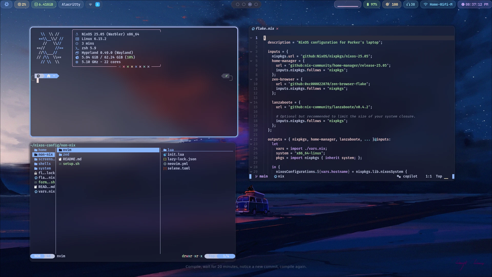
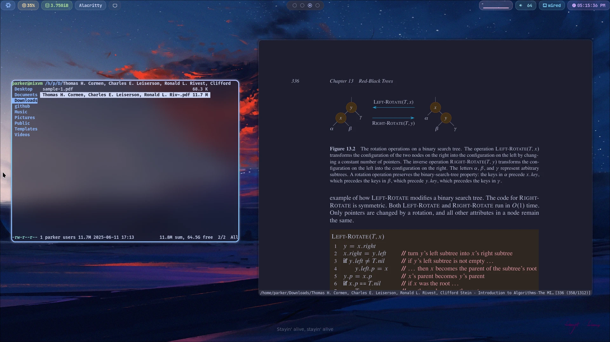
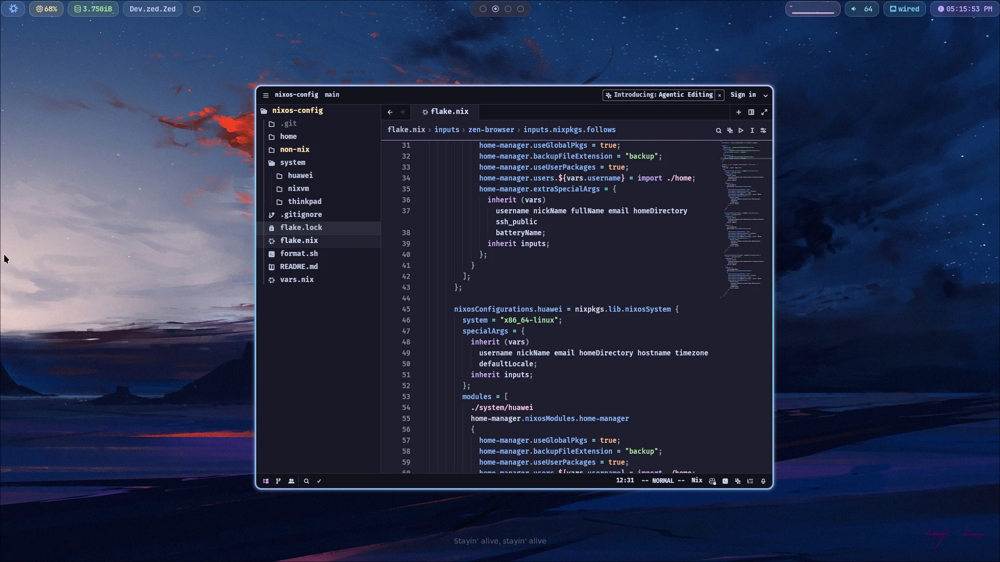
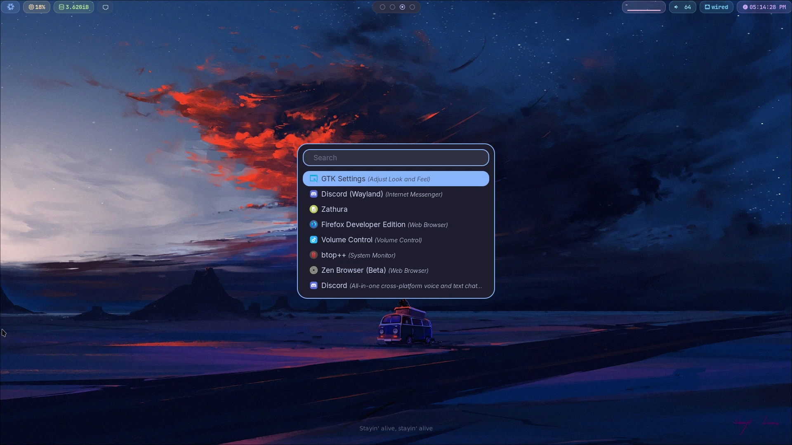
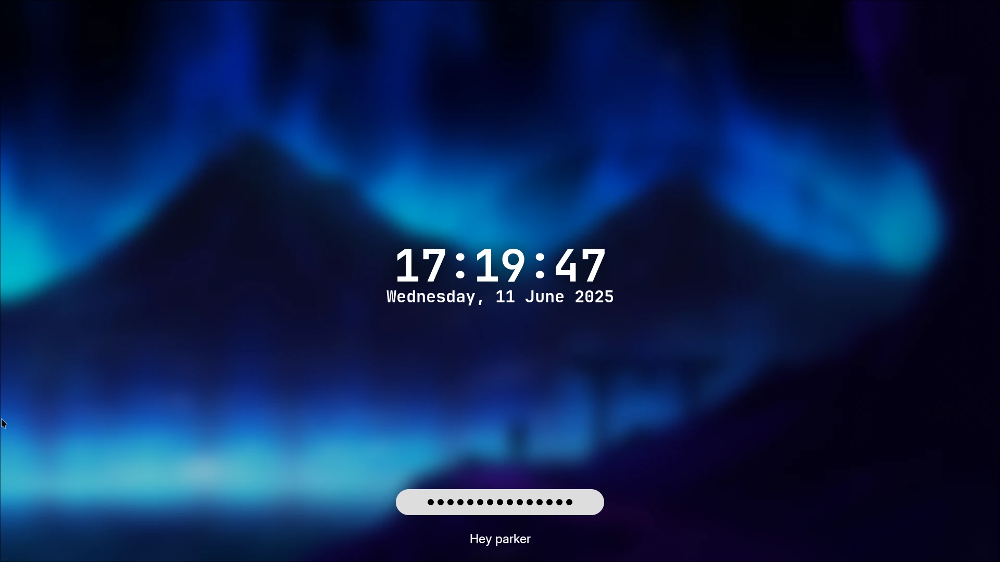
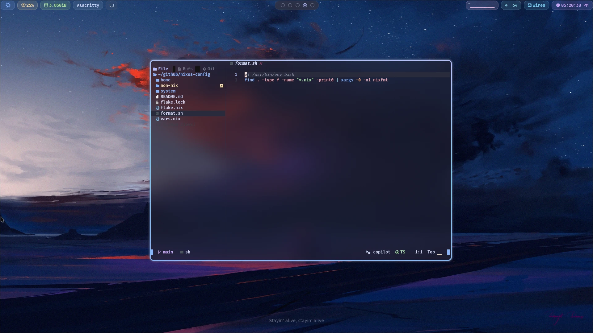
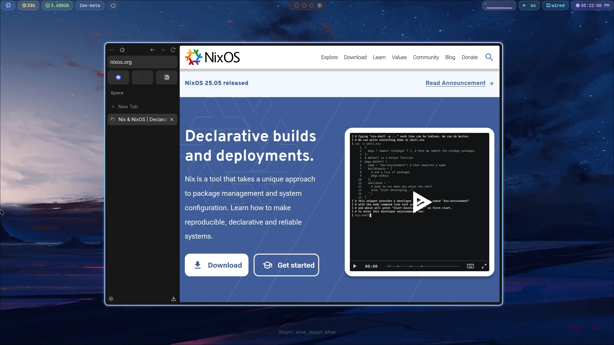

# NixOS configuration

You'll need to modify the `vars.nix` file in the root directory of this repo with the following content:

```nix
rec {
  username = "<your username>";
  nickName = "<your name for gdm>";
  fullName = "<your name for git>";
  email = "<your git email>";
  hostname = "<your hostname>";
  homeDirectory = "/home/<user>";
  ssh_public = ''<YOUR PUBLIC KEY - NOT NEW LINE TERMINATED'';
  timezone = "<your timezone>"; # e.g. "America/Santiago"
  defaultLocale = "en_US.UTF-8";
  batteryName = "<your battery name>"; # Get it from `ls /sys/class/power_supply`
}
```

Valid `hostname` values are `huawei`, `thinkpad` and `nixvm`. If you want to add your own, you can do so by adding a new entry in `flake.nix` and under `sysetm/`.

## Screenshots







